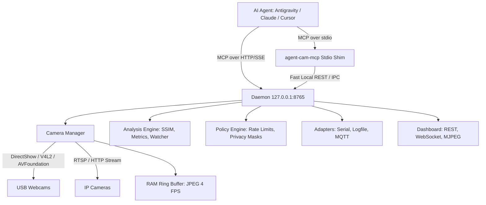

# Agent Cam MCP Tool

Physical camera perception, quantitative measurement, and verification tool for MCP AI agents.

[](https://github.com/skr-electronics-lab/agent-cam-mcp/actions/workflows/ci.yml)
[](https://pypi.org/project/agent-cam-mcp/)
[](https://pypi.org/project/agent-cam-mcp/)
[](https://opensource.org/licenses/MIT)
[](https://modelcontextprotocol.io/)

---

## 1. Overview

Agent Cam MCP Tool gives AI coding agents eyes on the physical world. It interfaces with USB webcams and RTSP/HTTP network camera streams, exposing them to any Model Context Protocol (MCP) compatible agent (Google Antigravity, Claude Code, OpenAI Codex, Cursor).

### The Problem
Agents working on embedded systems, robotics, CNC machinery, or 3D printers frequently declare builds or firmware flashes "successful" while the physical hardware remains unresponsive, stuck in a boot loop, or displaying error codes. Traditional agents rely solely on build return codes and serial logs.

### The Solution
Agent Cam MCP Tool allows the agent to inspect the physical hardware at any moment:
- Returns images directly as MCP image content (like browser screenshots in IDE agents). Nothing is written to disk by default.
- Returns quantitative numbers alongside visual frames (mean brightness, contrast, lit pixel percentage, dominant colors, edge density, sharpness, and motion level) so agents make decisions on hard evidence.
- Maintains an in-memory RAM ring buffer so agents can retrieve what happened before an error or correlate visual changes with serial logs.
- Includes a local developer dashboard to monitor camera feeds, define named regions of interest, apply privacy masks, and maintain user access control.

---

## 2. Cross-Domain Use Cases

- Embedded Boards: Verify power LEDs, RGB status indicators, seven-segment displays, and OLED boot screens after firmware flashing.
- 3D Printing: Inspect first-layer adhesion, detect spaghetti failures mid-print, and monitor nozzle travel.
- CNC & Laser Cutting: Inspect workpiece alignment, stock clamp clearance, and job completion.
- Robotics: Verify robot arm home positions, gripper actuation, and physical limit switch contact.
- Lab Benches: Read multimeter digits, oscilloscope waveforms, and power supply displays via OCR.
- Environmental Rigs: Monitor automated plant watering, aquariums, heating cycles, and prototyping rigs.
- Soldering & Inspection: Perform macro inspection of solder joints and component placement.

---

## 3. Architecture

Agent Cam MCP Tool utilizes a single long-lived daemon architecture to ensure multiple agent sessions never contend for hardware access:



### Why a Daemon?
Operating systems restrict camera hardware to a single accessing process. If every agent session spawned an independent camera process, conflicts and device locks would occur. The Agent Cam daemon exclusively owns the hardware, while the lightweight stdio shim transparently connects to the daemon, starting it in the background if it is not already running.

---

## 4. Key Features

- Direct MCP Image Content: Images are encoded as base64 JPEG/PNG objects directly within tool responses.
- Sub-5ms Image Delivery: Background grabber threads maintain a latest-frame slot in memory, eliminating camera warm-up delays.
- Quantitative Measurement: The `measure` tool provides deterministic numerical metrics without transmitting heavy image tokens.
- Watch Loops: The `watch` tool monitors physical feeds until a condition fires (`change`, `motion_start`, `motion_stop`, `brightness_above`, `brightness_below`, `color_present`) or a timeout occurs.
- Baseline Comparisons: Compute SSIM (Structural Similarity Index) and generate visual difference heatmaps against saved reference images.
- Timeline Correlation: Combine buffered frames with timestamped lines from serial COM ports, logfiles, or MQTT topics.
- Privacy & Safety Controls: Permanent privacy masks redact sensitive areas before frames reach agent results or the dashboard. A prominent toggle switch allows instant pausing of agent camera access.
- Local Offline Dashboard: Developer console built with zero external web requests or CDN dependencies.

---

## 5. Quick Start (Under 60 Seconds)

### Installation

Install via `uv` or `pip`:
```bash
# Using uv (recommended)
uv tool install agent-cam-mcp

# Or using pip
pip install agent-cam-mcp
```

With optional extras:
```bash
uv tool install "agent-cam-mcp[all]"
# Extras available: [serial], [mqtt], [ocr], [all]
```

### Run Self-Diagnosis
Verify all system dependencies and cameras:
```bash
agent-cam-mcp doctor
```

### Register with Your IDE
```bash
agent-cam-mcp install --client antigravity
```

---

## 6. Client Configuration

The installer automatically writes absolute executable paths to client configurations to prevent path resolution failures when IDEs are launched from desktop shortcuts.

### Google Antigravity
Config location: `~/.gemini/antigravity-ide/mcp_config.json`
```json
{
  "mcpServers": {
    "agent-cam": {
      "command": "D:\\Projects\\mcp-tool-development\\agent-cam-mcp-tool\\.venv\\Scripts\\agent-cam-mcp.exe",
      "args": [],
      "env": {},
      "disabled": false
    }
  }
}
```

### Claude Code
Run the registration command:
```bash
claude mcp add agent-cam -- "D:\path\to\agent-cam-mcp.exe"
```

### Cursor
Config location: `~/.cursor/mcp.json`
```json
{
  "mcpServers": {
    "agent-cam": {
      "command": "D:\\path\\to\\agent-cam-mcp.exe",
      "args": []
    }
  }
}
```

### OpenAI Codex / TOML Clients
Config location: `~/.codex/config.toml`
```toml
[mcp_servers.agent-cam]
command = "D:\\path\\to\\agent-cam-mcp.exe"
args = []
```

---

## 7. CLI Reference

| Command | Description |
|---|---|
| `agent-cam-mcp` | Run the stdio shim (launched by AI IDEs) |
| `agent-cam-mcp serve [--port 8765] [--host 127.0.0.1]` | Run the daemon process in the foreground |
| `agent-cam-mcp ui` | Ensure daemon is running and open dashboard in browser |
| `agent-cam-mcp status` | Print daemon uptime, cameras, and connected clients |
| `agent-cam-mcp stop` | Stop background daemon cleanly |
| `agent-cam-mcp doctor [--json]` | Execute 11 self-diagnosis checks |
| `agent-cam-mcp install --client <name> [--dry-run]` | Configure client (`antigravity`, `claude-code`, `cursor`, `codex`, `print`) |
| `agent-cam-mcp version` | Print package version |

---

## 8. MCP Tools Reference

All tools return structured JSON text blocks alongside image content when applicable.

| Tool | Parameters | Description |
|---|---|---|
| `get_status` | none | Daemon version, uptime, cameras, pause flag, buffer fill. Agents call this first. |
| `list_cameras` | `refresh?: bool` | List physical USB and IP cameras with IDs, resolutions, and states. |
| `capture_image` | `camera?`, `region?`, `width?`, `annotate?`, `format?` | Captures live image (default width 1024px, JPEG quality 80). |
| `capture_sequence` | `camera?`, `seconds (1-30)`, `fps (1-10)`, `region?` | Returns a multi-frame sequence rendered into a contact sheet. |
| `get_timeline` | `last_seconds (1-60)`, `camera?`, `include_events?` | Contact sheet of buffered frames aligned with adapter events. |
| `measure` | `region?`, `camera?` | Computes mean brightness, contrast, lit %, edge density, sharpness, motion. |
| `watch` | `region?`, `condition`, `threshold?`, `timeout_s (1-120)` | Asynchronously waits for visual condition with before/after evidence. |
| `define_region` | `name`, `x`, `y`, `w`, `h`, `camera?`, `units?` | Saves named region of interest using normalized or pixel coordinates. |
| `list_regions` | none | Lists all defined named regions. |
| `delete_region` | `name` | Deletes a defined region. |
| `request_region_from_user` | `name`, `message` | Prompts user on the dashboard to draw a region interactively. |
| `save_baseline` | `name`, `region?`, `camera?` | Persists a golden reference image in the data directory. |
| `compare_to_baseline` | `name`, `region?`, `camera?` | Computes SSIM score, changed pixel %, and diff heatmap. |
| `read_text` | `region?`, `camera?` | Extracts text and confidence using OCR (optional extra). |
| `set_camera_settings` | `camera`, `exposure?`, `focus?`, `brightness?`, `lock_auto?` | Negotiates driver settings and reports accepted vs ignored values. |
| `read_events` | `source`, `last_seconds?`, `lines?`, `until_text?`, `timeout_s?` | Reads timestamped events from serial ports, logfiles, or MQTT. |
| `run_action` | `name`, `args?` | Executes allowlisted system commands with optional timeline observation. |

---

## 9. Recommended Agent Instructions

Add the following verification policy to your project instructions (`AGENTS.md`, `GEMINI.md`, or `CLAUDE.md`):

```markdown
# Physical Verification Policy
Never report physical task completion or hardware success without verification:
1. Call `get_status` to ensure camera streams are active.
2. Call `capture_image` or `measure` to verify physical state (LEDs, displays, moving components).
3. If checking state changes, use `watch` or `compare_to_baseline`.
4. Quote exact observed values in your response (e.g. "Status LED brightness rose from 12.0 to 184.5").
5. Never assume success based solely on compiler output or flash utility logs.
```

---

## 10. Performance Benchmarks

Measured on a standard workstation (Python 3.11, Windows 11):

| Operation | Measured Latency | Specification Target | Status |
|---|---|---|---|
| `measure` (1080p frame) | **43.47 ms** | < 100 ms | PASS |
| `capture_image` (1024px JPEG, warm) | **3.23 ms** median | < 250 ms | PASS |
| `capture_image` (95th percentile) | **4.11 ms** | < 250 ms | PASS |
| Buffer RAM consumption (30s @ 4 fps) | **< 15.0 MB** | < 300 MB cap | PASS |
| Daemon startup health latency | **0.85 s** | < 3.0 s | PASS |

---

## 11. Security and Privacy

- Local Host Binding: Defaults to `127.0.0.1`. Non-localhost binding requires explicit flags and prints warnings.
- Header Validation: Strict verification of `Host` and `Origin` headers prevents cross-site scripting and DNS rebinding attacks.
- Access Token: Mutating endpoints require an authentication token generated per-installation and stored with user-only permissions.
- Action Allowlist: The `run_action` tool only runs commands defined in `config.json`. Subprocesses execute argv lists directly (`shell=False`).
- Privacy Redaction: Rectangular privacy masks black out pixels in the camera layer before frames reach agents, buffers, or previews.
- Agent Access Pause: A hardware pause toggle instantly revokes agent image access and returns a structured `paused_by_user` status.

---

## 12. Troubleshooting Guide

| Symptom | Cause | Solution |
|---|---|---|
| Black image returned | Privacy shutter closed or inadequate lighting | Remove lens cover; verify room illumination. |
| `camera_busy` error | Another application holds camera lock | Close video meeting software, browser tabs, or other capture tools. |
| Permission denied | OS camera privacy settings block access | Enable camera access in Windows Settings > Privacy > Camera or macOS System Settings. |
| Tools not showing in IDE | IDE has not reloaded MCP configuration | Restart the IDE completely to reload `mcp_config.json`. |
| Port 8765 occupied | Previous process lingering | Run `agent-cam-mcp stop` or check running processes. |
| High CPU usage | Full resolution MJPEG streaming | The dashboard automatically downscales preview streams to 720p. |

---

## 13. License

Released under the [MIT License](LICENSE). Copyright (c) 2026 SK Raihan.
